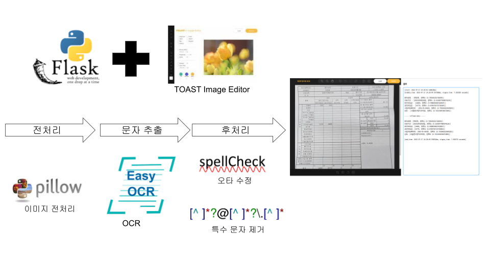
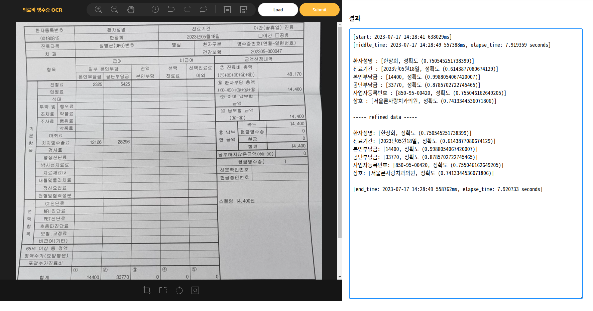

# 의료비 영수증 OCR

## 아키텍처

## 특징

* 이미지 편집 기능 제공
* 관심영역(ROI) 자동 추출
* 오타 수정
* 노이즈 문자 제거

## Lessons Learned

* OCR 인식률 개선을 위한 이미지 전처리시 같이 사용하는 OCR 라이브러리 특성 고려 필요
* OCR 추출 문자의 대상 범위가 존재할 경우 오타 수정을 통한 인식률 개선 가능성 확인
* 다양한 오픈 소스 라이브러리 활용을 통한 빠른 개발(TOAST Image Editor, EasyOCR, Symspell 등)

## 산출물

* Web Application

## 산출물 스크린샷

## 참고 자료

* [EasyOCR](https://github.com/JaidedAI/EasyOCR)
* [Image-editor](https://ui.toast.com/tui-image-editor)
* [Symspell을 이용한 한글 맞춤법 교정](https://heegyukim.medium.com/symspell%EC%9D%84-%EC%9D%B4%EC%9A%A9%ED%95%9C-%ED%95%9C%EA%B8%80-%EB%A7%9E%EC%B6%A4%EB%B2%95-%EA%B5%90%EC%A0%95-3def9ca00805)
* [MNIST를 이용한 과자봉지 글씨 인식하기 예제 참고](https://weejw.tistory.com/611)
